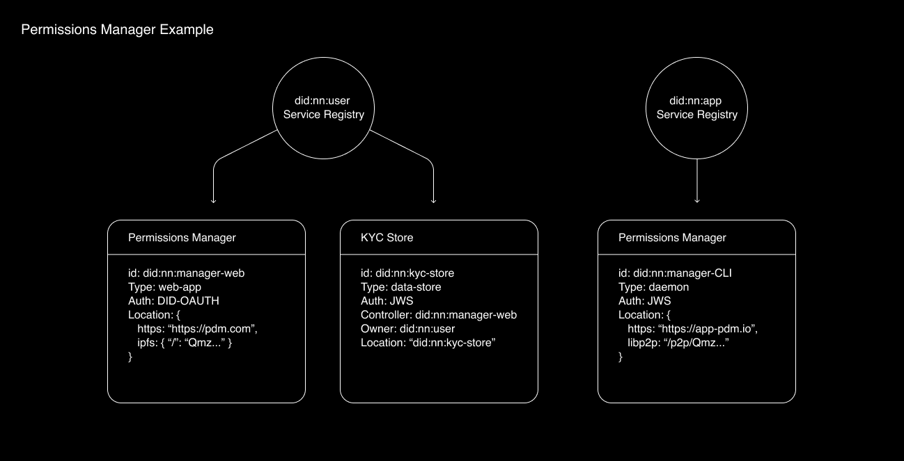
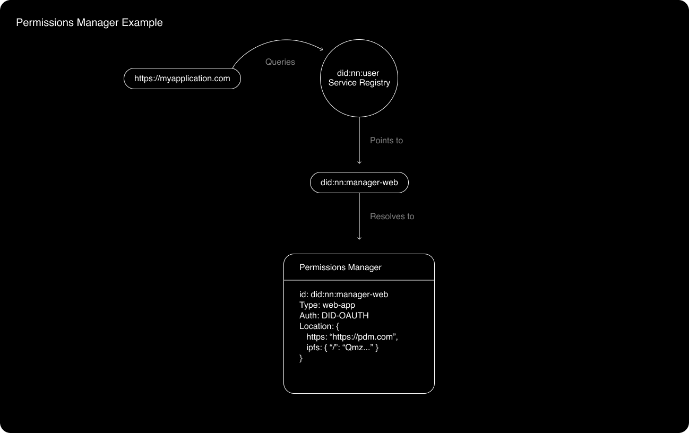
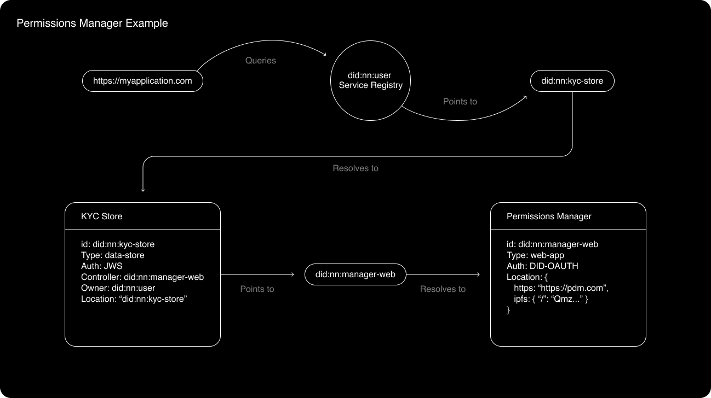
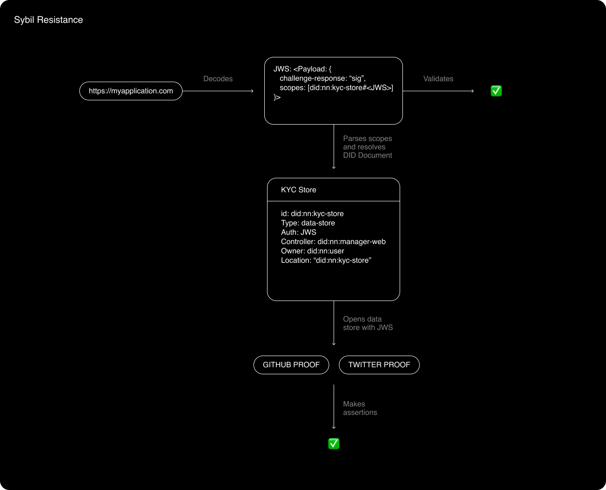

# Login to Applications with a Permissions Manager

The role of the permissions manager is illustrated best through example. Note that through these next examples, I’m using a **made up** DID protocol, specifically not to name any existing technologies. The made up DID protocol is called `did:nn` - and it simply resolves into a mutable DID Document. I also pose some hypothetical DID Documents - these are simplified for illustration purposes, and are technically inaccurate.

Let’s say we have User with DID `did:nn:user` that wants to login to application with DID `did:nn:application`. Let’s say `did:nn:app` has a web application hosted at https://myapplication.com. We’ll go through two examples - the simpler example illustrates how an application can login a user with a DID, as long as the user proves they own that DID. The more complex example illustrates how the application can enforce their own sibyl resistance policies - by requiring users to have both a Twitter and GitHub account that’s at least 1 year old.

## Simpler Example - User proves their ownership of `did:nn:user`

1.  User arrives at https://myapplication.com
2.  User sees a login prompt, enters in their DID, or a human readable string that resolves to their DID (through something like ENS). For simplicity, say the user enters the string `"did:nn:user"` into the application UI and clicks “login”.
3.  `did:nn:application` then:

    - Queries the did to see if it specifies an alternative DID service registry. In this example `did:nn` does not specify an alternative, so `did:nn:application` queries the default service registrar for a list of `did:nn:user` services.
    - `did:nn:application` finds the data manager service pointed at by the registrar under `did:nn:user`.
    - `did:nn:application` resolves the DID Document behind `did:nn:manager-web` (`did:nn:user`'s data manager service).
    - The document resolves into an instruction manual for logging in `did:nn:user`. The instructions say to use DID-OAUTH (a hypothetical authentication protocol used for this example).

4.  `did:nn:application` begins to follow the DID-OAUTH protocol:

    - It forwards the user to their data manager web app at https://pdm.com
    - It encodes a `challenge` query parameter and a `did` query parameter in the URL bar
    - `did:nn:manager-web` takes the`challenge`query parameter in the URL bar and asks the user to sign it as `did`.
    - The user is prompted to sign the challenge in order to login to https://myapplication.com, and confirms the signature request.
    - `did:nn:manager-web` forms a JWS, encoding the signed challenge as a claim in the JWS.
    - `did:nn:manager-web` forwards the user back to https://myapplication.com, with the JWS encoded as a query parameter in the URL bar
    - `did:nn:application` decodes the JWS payload, validates that it came from the `did` that it challenged, and that the correct challenge was signed.

5.  `did:nn:user` has successfully confirmed its controller to https://myapplication.com. https://myapplication.com can now issue a token or cookie to `did:nn:user` representing its authenticated status.

**Diagrams:**

Illustrates steps 1-3:

Illustrates steps 4 & 5:

## Complex example - user proves they have a GitHub and Twitter Account older than 1 year

In this example, let’s look at how `did:nn:application` can request access to a specific data store owned by `did:nn:user`. This only requires a few slight adjustments and 1 extra resolution step.

1.  User arrives at https://myapplication.com
2.  User sees a login prompt, enters in their DID, or a human readable string that resolves to their DID (through something like ENS). For simplicity, say the user enters the string `"did:nn:user"` into the application UI and clicks “login”.
3.  `did:nn:application` then:

    - Queries the did to see if it specifies an alternative DID service registry. In this example `did:nn` does not specify an alternative, so `did:nn:application` queries the default service registrar for a list of `did:nn:user` services.
    - `did:nn:application` finds the KYC data store service pointed at by the registrar under `did:nn:user`.
    - `did:nn:application` resolves the DID Document behind `did:nn:kyc-store`.
    - The document resolves into an instruction manual for requesting access to `did:nn:user`'s KYC information. The instructions say to use JWS, and the controller is `did:nn:manager-web`.
    - `did:nn:application` resolves the DID Document behind `did:nn:manager-web`.
    - The document resolves into an instruction manual for logging in `did:nn:user`. The instructions say to use DID-OAUTH (a hypothetical authentication protocol used for this example).

4.  `did:nn:application` begins to follow the DID-OAUTH protocol:

    - It forwards the user to their data manager web app at https://pdm.com
    - It encodes a `challenge` query parameter, a `did` query parameter in the URL bar, and a `scopes` parameter in the URL bar. The `scopes` parameter should provide more context to `did:nn:manager-web` when forming the JWS.
    - `did:nn:manager-web` takes the `scopes` query parameter in the URL bar and resolves the DID Document behind the included scope to get more information.
    - `did:nn:manager-web` learns the requested scope is the user’s KYC data store, and that the KYC data store requires a JWS to access it.
    - `did:nn:manager-web` asks the user if they’d like to give https://myapplication.com access to their KYC data store.
    - If the user accepts, `did:nn:manager-web` derives the JWS used to access control the user’s KYC data store (referred to as “access key”). This could be done through signing a specified message, or stored encrypted on another one of the user’s data stores.
    - `did:nn:manager-web` takes the `challenge` query parameter in the URL bar and asks the user to sign it as `did`.
    - `did:nn:manager-web` forms a JWS, with the signed challenge and the KYC Data store access key stored as claims.
    - `did:nn:manager-web` forwards the user back to https://myapplication.com, with the JWS encoded as a query parameter in the URL bar
    - `did:nn:application` decodes the JWS payload, validates that it came from the `did` that it challenged, and that the correct challenge was signed.

5.  `did:nn:application` parses the KYC data store access key, and uses it to open the KYC data store.

6.  `did:nn:application` finds various verified credentials located in the KYC data store, 1 for Twitter, and 1 for GitHub.
7.  `did:nn:application` can then assert what it wants on the verified credentials - even using the originating apps’ APIs to get more information about the user account. For instance, `did:nn:application` can assert that the user’s GitHub and Twitter accounts are at least 1 year old.
8.  `did:nn:application` either accepts or rejects the user based on their verified credentials.

**Diagrams:**

Illustrates steps 1-3:

Illustrates step 4:

Illustrates steps 5-8:

## Concluding thoughts

The point of these examples is to illustrate the roles and responsibilities of the PDM in terms of enforcing rules on DID Documents and writing new ones. The reader is not meant to assess the security of the made up authentication protocols, since those can be swapped in and out.

The closest things I’ve seen that form the basis of a “permissions manager” are [SpruceID](https://spruceid.dev/docs/credible/), [Fission](https://auth.fission.codes/), and [3id-connect](https://github.com/ceramicstudio/3id-connect). [Mastodon](https://docs.joinmastodon.org/user/signup/) also has a PDM-like architecture built-in - where users sign up with a specific domain, tying their to a specific domain.
