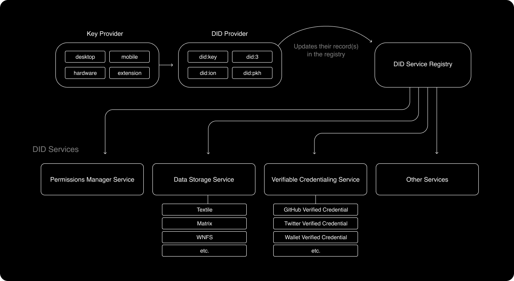
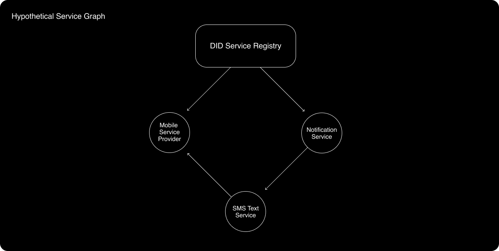
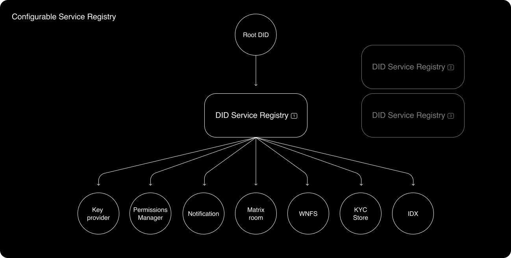

# Why Interoperability?

In order to make decentralized identity the new normal, interoperability is a requirement. Interoperability means a user can log in to any app with any of their online personas and frictionlessly switch between them. Interoperability means shared standards for safe and cohesive experiences across the internet. Interoperability means less data monopolies. Interoperability is the goal.

Interoperable identity is a hard problem to solve. It’s difficult at the technical level because it requires dealing with immature technologies whose scale is barely tested, business models non-existent, and financial situations opaque. It’s difficult at the human coordination level because it requires highly opinionated groups of people to agree with one another on technical strategies - some of which could have huge economic impacts.

We’re reaching an inflection point - decentralized identity has an opportunity to subvert the internet’s identity model at a time when momentum and desire to change is at an all time high. By focusing on interoperability, we can counter the [objections](https://www.evernym.com/blog/w3c-vision-of-decentralization) to DIDs being an approved W3C standard and realize a healthier internet for end users. If YOU care about decentralized identity, YOU should care about interoperable identity.

This post is meant to serve as a starting point to discuss and eventually agree on an Interoperable Identity Standard (IIS). My hope is to work with the many teams and individuals in this space to finalize an IIS, so we show the world what a healthier internet looks like and actually realize it.

## Proposal for an Interoperable Identity Standard

### Interoperable Identity Standard Key Features:

- A [W3C spec compliant decentralized identifier](https://www.w3.org/TR/did-core) (DID) based framework.
- Every unique entity is the subject of a DID.
- Every DID points to a service registry, which stores pointers to any number of DID “services” such as data storage, data permissioning, data synchronization, data archiving, verified credential issuing…etc that the originating DID has registered with.
- Each service is also treated as a unique entity; it also has a DID, which points to a service registry.
- Verified credentialing storage and permissioning services can serve as the basis of robust reputation and sybil resistance systems.

## Key Provider

A key provider takes care of three core responsibilities:

- sign messages
- encrypt data
- decrypt data

These responsibilities are important for upstream operations.

Key providers can be non-custodial, putting users in total control of their keys. For example, [Rainbow Wallet](https://rainbow.me/), [MetaMask](https://metamask.io/), or [Ledger](https://www.ledger.com/) could serve as non-custodial key providers.

Key providers can also be semi-custodial or custodial. A semi-custodial key provider might look like [Magic Link](https://magic.link/docs/api-reference/client-side-sdks/web), and a custodial key provider could be a service like [Google KMS.](https://cloud.google.com/security-key-management)

A healthy IIS makes it easy for users to choose from several Key provider options and migrate from one option to another.

## DID Provider

In our system, a DID represents a unique entity (or “[subject](https://www.w3.org/TR/did-core/#did-subject)” according to the official DID vocabularies). An “entity” could be a human, a group, an application, a data store… or any unique “thing” that can be pointed to from other entities in a graph.

Due to the large number of DID methods (with more incoming), an entity like a user, org, or application must have flexibility when deciding which DID provider to use based on its needs in any given context. Different DID methods are purposed for different use cases and come with trade-offs. For instance, `[did:key](https://w3c-ccg.github.io/did-method-key)` does not rely on network calls to resolve DID documents, making it a justifiable choice for users that care about uptime and speed when performing actions on a network. The trade-off is `did:key` is limited in its flexibility and usefulness. Alternatively, other DID methods can be built with more features, but not without tradeoffs - for example, more complex DID methods may rely on network requests to resolve DID Documents, which will take longer and open up new attack vectors.

More information on the [W3C DID specification](https://www.w3.org/TR/did-core/). See the many DID methods on the [W3C's official DID registry](https://www.w3.org/TR/did-spec-registries/#did-methods).

**DID provider reliance on Key provider**
The key provider is the “controller” of a DID. Signatures are requested by the DID provider and executed by the Key provider to perform actions like authoring changes to the DID itself, delegating access roles to a specific data store, or proving ownership over content or crypto-assets.

Decoupling the key provider from the DID provider increases the flexibility in how users compose their online identities. Mainstream users might choose a custodial key provider and `did:key` for a fast and familiar web UX, akin to logging in to Twitter or Instagram. Other users might select a combination of non-custodial and semi-custodial key providers as controllers for a `did:3` to recreate a multi-factor authentication UX flow for sharing more sensitive data or authorizing contractual agreements.

## DID Service Registry

DIDs should be able to register with different service providers for jobs like data backups, data storage / permissioning, notifications… etc. The DID service registry can be thought of as a “root” or “head” node in a graph that contains one or more pointers to all the important DID services that a DID might rely on.

Services themselves are subjects represented by DIDs. Machine readable information about services and how to interact with them should be encoded in the service’s associated DID Document. This approach allows teams to continue building out their own standards and strategies that make the most sense _for their service_, without the highest level architecture having to care about the micro strategies employed by individual services. This means the same user should be able to seamlessly interact on services like Mastodon, Matrix, and Urbit, even when the underlying data structures, standards, and permissioning of those services are completely different from one another. It also means the user can employ any number of centralized and decentralized services that make sense in their context.

Services can also link together in a cyclic graph structure, to point to other services that the service itself relies on.

The graph-like service structure enables machine readable instructions for interacting with any type of DID related service by recursively iterating through a specific sub-tree.

The registry is an area of the stack that intuitively seems like valuable real estate to occupy. However, if we build in the ability for a DID provider to point to its own service registry, or for a DID provider to potentially act as an embedded service registry itself, then the initially chosen technologies are not bound to dominate the DID ecology in the long term. This essentially means moving the Identity’s “root” node up one level higher to its own DID Document.

There are a number of unsolved challenges that present themselves in this area of the stack:

1. Not all DID methods can resolve to mutable DID documents, which means that we _at least_ need to choose a default service registry for DID methods such `did:key`.
2. Registries must agree on a minimum data standard and vocabulary set in order for them to be seamlessly pluggable and migrateable.
3. There could be an enormous number of services that get built, each with their own standards and strategies - how can this scale?

Today, I think [IDX](https://idx.xyz/) and [ENS](https://ens.domains/)+[IPNS](https://docs.ipfs.io/concepts/ipns/) are well positioned to be DID service registry candidates. I will follow up with another post diving deeper into these two alternatives for the DID service registry.

## Data Storage Services

“Data stores” are a generic way to describe a large number of DID “services” that store and permission data. Theoretically, a data store could be one of:

- [A Matrix Room](https://matrix.org/docs/spec/#room-structure)
- [A Ceramic TileDocument](https://developers.ceramic.network/streamtypes/tile-document/overview/)
- [IPFS/IPNS/Filecoin](https://docs.ipfs.io/concepts/faq/#ipfs-and-filecoin)
- [Webnative File System](https://guide.fission.codes/developers/webnative/file-system-wnfs)
- [A Radicle Project](https://docs.radicle.xyz/docs/using-radicle/overview)
- [A Textile ThreadDB](https://docs.textile.io/threads/) (or bucket)
- A KYC specific data store (stores verified credentials)
- An Elastic Search Instance
- A Caching Server
- AWS, Google Cloud…etc.

An identity architecture should not hold opinions over the strategies for data storage and permissioning because no one size fits all model exists - what works for GitHub may not work for Elastic Search. Instead, the identity architecture should delegate those decisions to the specific service provider.

One way to accomplish this is to represent service providers as DIDs. The DID Subject would be the data storage service itself, and the DID Document would describe information about how to find and interact with that service. The DID Document should also describe the type of access control that governs the service, and how to go about authentication. As an example, here’s a [discussion about DID-ifying a Textile Thread](https://github.com/textileio/community/discussions/295), which (if/when implemented) would make a Textile Thread compatible with this IIS.

## Permissions Manager

At a high level, a DID’s permissions manager has three responsibilities:

1. Enforce access control rules written on DID Documents that belong or associate with the root DID. A common example would be issuing a web or mobile application an access token to user data at the user’s request.
2. Bookkeep changes to the root DID and its services via DID Documents.

A permissions manager can take different forms. A user’s chosen permissions manager might be packaged in a web application that manages permissions via an OAuth-like DID protocol. An application’s permissions manager might be composed of a daemon and CLI, and implement an alternative auth strategy.

**Login to applications with OAuth and a permissions manager - two concrete examples**
[+Login to Applications with a Permissions Manager](https://github.com/owncore/interoperable-identity-standard/blob/primary/PERMISSIONS_MANAGER.md)

# Reputation and sybil resistance

Reputation and sybil resistance are two sides of the same coin - with reliable reputation information, an application can approve or deny service to users in whatever way it chooses. However, similarly to data storage and permissioning strategies, there’s no “one size fits all” reputation or sybil resistance system. An application needs flexibility in how it determines reputation, and protects against sybil attacks. Therefore, we should be building sound, foundational, reputation building blocks into the protocol, and avoid making any assertions about reputation itself at the protocol layer. Instead, a subset of DID services should exist that offer their own reputation systems, and applications can choose which reputation services make the most sense in their context, or build their own.

## Verified credentials are sybil resistance & reputation building blocks

[Verified credentials](https://www.w3.org/TR/vc-data-model/) provide a mechanism to express credentials on the Web in a way that is cryptographically secure, privacy respecting, and machine-verifiable. A credential is a vague term that encompasses anything “claimable” - for instance, you could claim you own a social media account or a crypto address. You could also claim you own a driver’s license or a piece of content on IPFS.

Verified credentials can serve as sound, foundational reputation building blocks. The protocol needs a way to store, access, and identify what these credentials are, and then applications can use this information in the ways they see most fit.

Entire SDKs and APIs can be built around the verified credential store of a DID. For example, a centralized crypto exchange in the US might open source an SDK that loads verified credentials from a DID and computes a “KYC Score” that represents a risk factor for being in or out of compliance with government regulations. Alternatively, the next big NFT project might wish to allow 1 NFT per unique human, and build an API for asserting the user has at least 3 social media accounts with more than 500 total followers or 1000 total likes.

In this article, I discuss a _hypothetical_ [verifiable credentialing service](https://github.com/owncore/interoperable-identity-standard/blob/primary/VERIFIABLE_CREDENTIAL.md).

# Towards an Interoperable Identity Standard

It’s time to show the [Google’s, the Apple’s, and opposers alike](https://www.evernym.com/blog/w3c-vision-of-decentralization) that we can achieve an Interoperable Identity Standard together. Next steps for me - rally together the opinionated folks, the OG’s of decentralized identity, the early web tribes, and together, create the best possible standard that moves all of us forward.

If you have feedback, comments, questions…etc, please [file an issue](https://github.com/owncore/interoperable-identity-standard/issues).
