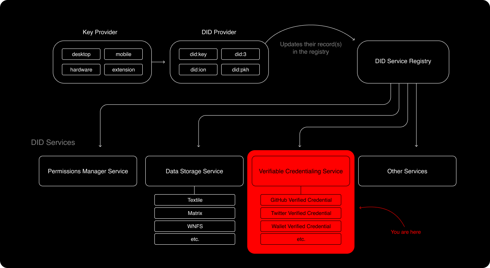
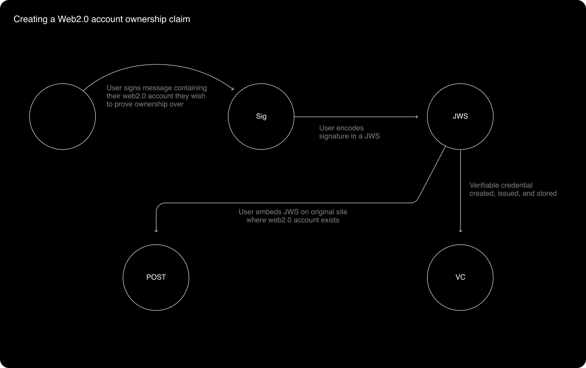
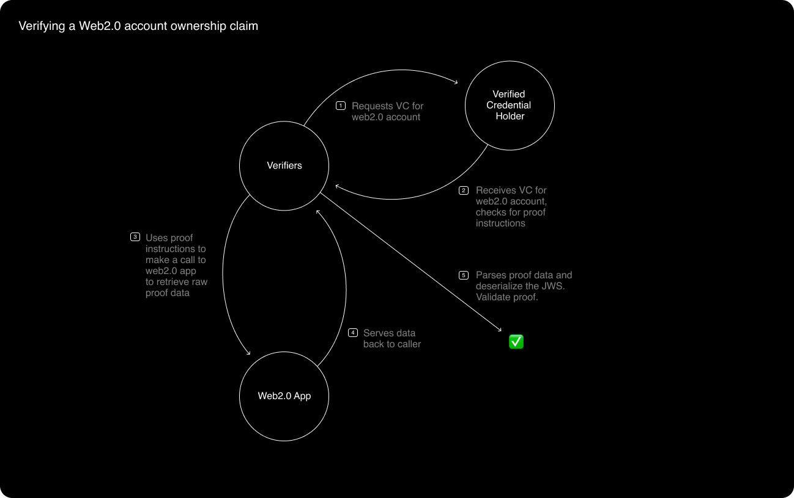
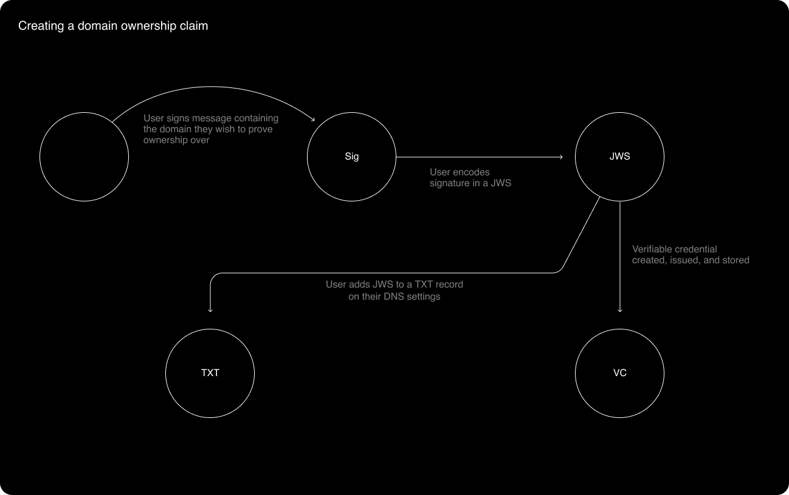
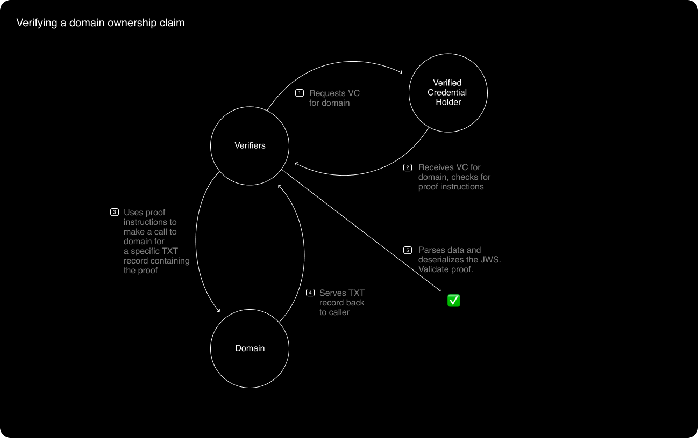

# Populating an Identity Hub - Bluesky Satellite

_Our digital identities are like satellites we launch into cyberspace. You may link one to another here and there, but how would you link all of them, systematically, in a way that proves to others they belong to you?_

# Prereading

This post relies on the “Interoperable Identity Standard” written about [here](https://github.com/owncore/interoperable-identity-standard/blob/primary/README.md).

**Interoperable Identity Standard Key Features:**

- A [W3C spec compliant decentralized identifier](https://www.w3.org/TR/did-core) (DID) based framework.
- Every unique entity is the subject of a DID.
- Every DID points to a service registry, which stores pointers to any number of DID “services” such as data storage, data permissioning, data synchronization, data archiving, verified credential issuing…etc that the originating DID has registered with.
- Each service is also treated as a unique entity; it also has a DID, which points to a service registry.
- Verified credentialing storage and permissioning services can serve as the basis of robust reputation and sybil resistance systems.

# You are here \*

We’ve talked through quite a few architectural components across the silhouette architecture. This post is primarily concerned with designing a _hypothetical_ verified credentialing service.

# Designing “🔑 Credential Guardian 🔑” - a hypothetical DID Verified Credentialing Service

To zoom out a bit, a DID can theoretically choose _any_ verified credentialing service it chooses. 🔑 Credential Guardian 🔑 could be one of many options.

## Stories

1. A user should be able to prove ownership over:
   - A custodial (web2.0) account
   - A domain name (a website)
   - A public/private keypair (including a crypto wallet address)
2. A user should be able to form more complex ownership proofs:
   - An on-chain asset (NFT, Multisig)
   - A non-custodial (web3.0) account
3. Verified claims should exist for meat space items:
   - A physical asset like a house or bank account (SSB account)
   - A highly sensitive piece of information like a social security number or a driver’s license
4. A user should have granular privacy controls.

# Ownership claims as verified credentials

A DID can use [verifiable credentials](https://www.w3.org/TR/vc-data-model/#what-is-a-verifiable-credential) to make ownership claims over accounts, assets, and content, effectively “linking” these items to the DID. Verifiable credentials follow a strict yet extensible data model that fits a variety of use cases. However, this post cares more about verifiable credentialing as a conceptual framework, rather than expressing relationships with any specific data models or vocabularies. Conceptually, a verifiable credential includes a “claim” about a “subject”, and some evidence for that claim - called a “proof”. A verifier can validate a claim by checking its proof.

With this in mind, I’ll start by showing how to conceptually form a verifiable credential by claiming ownership over different types of accounts, content, and assets. For each of these examples, I’ll describe:

1. What **claim** do we make?
2. How do we **create** the **proof**?
3. How does a verifier **validate** the **proof**?

For the following examples, we’ll pretend `did:key:user` is the identity’s “root”, which we want to verifiably link our accounts, assets, and content to.

## Web2.0 Social Accounts

**_What claim do we make?_**

`did:key:user` is the _OwnerOf_ Social account X (e.g. a username on Twitter, Reddit).

**_How do we create the proof?_**

Teams like Keybase and Ceramic have already paved the way for a publicly verifiable way to prove ownership over a web2.0 account like Twitter and Reddit. The idea is to sign a message containing the web2.0 account in question, encode the signature into a JWS issued by `did:key:user` , and embed the JWS in an API accessible endpoint like a “Post”, “Tweet”, or “Bio” on the original web2.0 application. The embedded JWS _is_ the proof.

**_How do we verify the proof?_**

A JWS proof can be verified by requesting the relevant data (“Tweet”, “Bio”…etc) directly from the original web2.0 application site. Upon receipt, the verifier should parse the data and deserialize the embedded JWS. The verifier should check that the issuer of the JWS is `did:key:user`, and that the signed message encoded in the JWS is the web2.0 account in question.

**_Miscellaneous notes_**

1. When validating the verifiable credential, the instructions about _how_ to fetch the data from the original web2.0 application should be encoded in the verifiable credential itself.
2. When creating the proof, it’s important `did:key:user` signs the web2.0 account in question (and not some arbitrary message). This protects against any web2.0 account claiming to be owned by someone else’s DID (the reverse relationship). We don’t want Joe Schmoe to claim his Twitter is owned by Jay-Z’s DID.
3. Here’s an [example](https://github.com/ceramicnetwork/CIP/blob/main/CIPs/CIP-23/CIP-23.md#example) of how Ceramic encodes social accounts as verifiable credentials in their “Also Known As” DocType.
4. When it comes to proving ownership of a Mastodon or Matrix account, this strategy is probably the most applicable. Instead of verifiers talking to web2.0 apps to verify proofs, verifiers would ask a specific Mastodon server or Matrix Homeserver for those proofs and verify them. This becomes challenging, however, in that it could add a surface area of spec compliance to creating a custom Mastodon or Matrix Homeserver.

## A domain name (a website)

**_What claim do we make?_**

`did:key:user` is the _OwnerOf_ a domain.

**_How do we create the proof?_**

Creating a proof of ownership over a domain works similarly to proof of ownership over a web2.0 account, with only one difference. Instead of embedding the proof in an API accessible endpoint like a “Tweet”, the domain owner should add the proof as a TXT record on their DNS settings.

**_How do we verify the proof?_**

A JWS proof can be verified by requesting the relevant TXT record directly from the domain in question. Upon receipt, the verifier should parse the TXT record and deserialize the embedded JWS. The verifier should check that the issuer of the JWS is `did:key:user`, and that the signed message encoded in the JWS is the domain in question.

**_Miscellaneous notes_**

Just like with web2.0 account ownership claims, it’s important to sign the domain (and not some arbitrary message) when creating the proof, so that a domain can’t claim to be owned by a DID (the reverse relationship). We don’t want Joe Schmoe to claim his domain j.com is owned by Jay-Z’s public DID.

## Public/private keypair

**_What claim do we make?_**

`did:key:user` is the _OwnerOf_ public key Y

**_How do we create the proof?_**

In order to prove ownership over a public/private key pair, the owner must digitally sign a message using the private key of the key pair. This signature should be encoded in the proof of the verifiable credential.

**_How do we verify the proof?_**

In the simplest, least secure case, the verifier must validate the signature encoded in the proof. See section below for security implications.

**_Miscellaneous Notes_**

1. A DID that wishes to prove ownership over a specific blockchain account can use this strategy too. However, additional metadata is required to denote the public key in question _is_ a blockchain address. It should also include what blockchain network this public key is designed to interact with. [CAIP-10](https://github.com/ChainAgnostic/CAIPs/blob/master/CAIPs/caip-10.md) is the most well known standard (I know of) to represent blockchain addresses in this fashion, and should work well in a verifiable credential system.
2. Since a public/private key pair cannot point _back_ its owner like an application or domain can, key pair ownership proofs are susceptible to replay attacks. Anyone can take the proof and then reuse the proof to claim _they_ are the actual owners of the private/public key pair in question.

   Three types of defenses against replay attacks come to mind in this scenario:

   1. Verifiable credentials for key pairs are created on the fly in a challenge - response type protocol. The verifier challenges the verifiable credential subject to sign a specific message, and the verifier can validate the specific message was signed by the private key of the key pair. This strategy is acceptable when the verifiable credential subject is always available to sign messages (like a daemon process), but it would not work well if the subject must prove ownership 24/7 (like a social web application) because the subject would have to always be online.
   2. More than one verifiable credential for a single key pair is created. Each verifiable credential proof is formed with a unique nonce. The verifier can request a proof at a specific nonce, making it more difficult to execute a successful replay attack. The imposter would have to copy potentially hundreds of signatures - one for each nonce.
   3. The verifiable credential for a key pair includes an expiration, which the user must continuously renew whenever they go “online” again. Verifiers should reject stale proofs, so replay attacks only last for a short duration.

# Credential graphs

Up until now, each example makes a single ownership claim. However, to create more complex verifiable credentials, claims can be linked together in a graph to create unique relationships. This would be helpful, for example, when proving things like a DID’s membership in a DAO, or a DID’s ability to drink alcohol in the United States. Verifiable credential graphs are also more likely to be useful in sybil resistance systems because they enable flexibility in measuring reputation.

The next two examples - proving ownership over an on-chain asset (NFT, Multisig) and a non-custodial (web3.0) account - we’ll cover in the same section because they both require similar credential graphs.

For these examples, let’s pretend the same Ethereum wallet `0xuser` owns the NFT `0xNFT` and also owns an account named `Owncore.eth` on [ENS](https://ens.domains/).

**_What claims do we make?_**

1. The Ethereum Address `0xuser` is the _OwnerOf_ `0xNFT`
2. The Ethereum Address `0xuser` is the _OwnerOf_ `Owncore.eth` on ENS.
3. `did:key:user` is the _OwnerOf_ Ethereum Address `0xuser`

Therefore, `did:key:user` owns `0xNFT` and `Owncore.eth`

You may notice that we’ve already illustrated how to prove and verify claim #3 above, so we only need to figure out a strategy for proving claim #1 and #2 - that `0xuser` owns `0xNFT` and `Owncore.eth`. Once we verifiably prove claim #1 and #2, we can link them to claim #1 in a credential graph.

**_How do we verify the proof for claims #1 and #2?_**

In this example, it helps to work backwards - start by understanding how to validate the proofs, and then figure out the right way to create them.

Verifiable claims can rely on a specific [verifiable data registry](https://www.w3.org/TR/vc-data-model/#dfn-verifiable-data-registries) to provide more information and context. In this example, we can rely on Ethereum to act as that verifiable data registry and provide the evidence a verifier would need to validate the claims. To get even more precise, the smart contract that minted `0xNFT` can act as the verifiable data registry for claim #1, and ENS can act as the verifiable data registry for claim #2. For instance, the owner of `0xNFT` can easily be found by calling the `ownerOf` function on an ERC721 compliant smart contract. The controller of `Owncore.eth` can be found by interacting with ENS directly. As long as we trust our verifiable data registries, they should suffice in providing the evidence we need to prove claims #1 and #2.

**_How do create the proof for claims #1 and #2_**

Since we can rely on a verifiable data registry to provide the necessary evidence for proving our claims, the biggest challenge in creating the proof is standardizing a data model that verifiers correctly interpret to fetch and validate the required information. For an EVM powered smart contract, the data model would need to include:

- Smart contract ABI for functions needed to call
- Smart contract address for where it lives on Ethereum
- Order and arguments of functions to call

Standardizing credential graphs that rely on verifiable data registries and interoperate with each other is challenging to coordinate. In order for it to work well, the majority of teams would need to agree on these standards, and many standards would have to exist. A DAO or TCR based structure could be used to coordinate these standard efforts, and economically incentivize its contributors.

# Meat space verifiable credentials

“The oracle problem” is commonly used to describe the limitation with public blockchains - they can’t natively incorporate meat space data without breaking the blockchain’s trust model. “Oracles”, which alleviate these limitations, inject real world information into smart contracts. However, users are forced to place some amount of trust in these oracle systems to provide the right data.

Oracles could also be used to issue verifiable credentials concerning things that appear outside of the digital world. Verifiable credential oracles could be called “verified notaries”.

Notaries like this already exist in the real world. For example, employers may contact a potential employee’s educational institution to get a copy of their transcript and the government to provide a background check. The employer trusts these institutions to provide the correct information. We can build off these existing systems to issue meat space verifiable credentials. Any notary that exists today could be converted into a verified notary simply by:

1. Generating a new private/public keypair
2. Providing a verifiable credential that the notary owns the newly generated private/public key pair
3. Becoming a verifiable credential issuer
4. Responding to valid claim requests with a verified credential from the notary, which serves as proof for the claim.

For the next example, let’s imagine `did:key:user` wants to prove they own the house at 100 Dweb Street in the United States. Let’s also imagine the United States Postal Service is a trusted verified notary.

**_What claims do we make?_**

`did:key:user` is the _OwnerOf_ 100 Dweb Street, USA.

**_How do we create the proof?_**

`did:key:user` has to interact with the USPS directly to get a proof of their claim. Either online or in-person, `did:key:user` must prove they own 100 Dweb Street with valid documentation like a house title or a mortgage. Once approved, the USPS will then issue a verifiable credential to `did:key:user`, which `did:key:user` can custody, or hand over to 🔑 Credential Guardian 🔑 to hold.

**_How do we verify the proof?_**

The proof can be verified by validating its issuer is a verified notary.

**_Miscellaneous notes_**

- In order for this strategy to work, a list of verified notaries would need to be agreed upon. In a perfectly decentralized world, a DAO would form with the sole responsibly to maintain a registry of verified notaries. This is similar to how [Filecoin+](https://docs.filecoin.io/store/filecoin-plus/#using-datacap) intends to work.

# Privacy and security

Privacy and security must be considered when designing a verifiable credentialing DID service because verifiable credentials can encapsulate highly sensitive information. It would be harmful to users if things like social security numbers, bank accounts, and crypto assets were leaked. There are three strategies we can take to increase the security and privacy capabilities of 🔑 Credential Guardian 🔑:

1. 🔑 Credential Guardian 🔑 should use [verifiable presentations](https://www.w3.org/TR/vc-data-model/#presentations) to present verifiable credentials and their claims to verifiers.
2. 🔑 Credential Guardian 🔑 should offer a spectrum of storage options for each verifiable credential based on the DID’s privacy requirements.

## Verifiable presentations

DID owners should be able to prove a claim or a graph of claims without revealing personally identifiable information included in the claim’s proof. For instance, a DID should be able to prove it is a US citizen, without exposing its owner’s social security number or driver’s license. To accomplish this, 🔑 Credential Guardian 🔑 should use [verifiable presentations](https://www.w3.org/TR/vc-data-model/#presentations).

Verifiable presentations are used to express a subset of a DID’s verifiable credentials that are appropriate for a given situation. For instance, if a verifier wants to prove `did:key:user` owns `Owncore.eth`, 🔑 Credential Guardian 🔑 should package up each of the individual verifiable credentials into a single verifiable presentation and serve it. This preserves privacy at a basic level - verifiers only get access to the verifiable credentials they care about, and no more.

To protect users even more, verifiable presentations can be packaged in a way that is cryptographically verifiable but does not reveal any individual verifiable credential itself. This solution is harder to implement, but there are sufficient analogous examples in the wild to model this relationship from. One that comes to mind is [Ocean Protocol’s Compute-to-Data feature](https://blog.oceanprotocol.com/v2-ocean-compute-to-data-guide-9a3491034b64). One challenge to think deeper about is preserving verifiable credential trust models without supplying raw proof data.

Serving only the verifiable credentials that matter and (in some cases) keeping the verifiable credential itself opaque in the eyes of a verifier allows 🔑 Credential Guardian 🔑 to preserve a DID’s privacy as much as possible - it serves any given verifier the minimum amount of data possible to prove a claim.

## Security considerations

On July 15, 2020 [Twitter was hacked](https://www.wired.com/story/inside-twitter-hack-election-plan/) and user accounts like Elon Musk and Jeff Bezos were impersonated. On October 1, 2021, Twitter user [@mah_twittar describes a kidnapping event](https://twitter.com/mah_twittar/status/1444088042520723456?s=20) where the kidnappers held @mah_twittar hostage until he forked over his crypto assets. These two attacks represent security vulnerabilities on the far ends of the identity custodial vs non-custodial spectrum, and they can help inform the right security design decisions for 🔑 Credential Guardian 🔑’s verifiable credential **storage** layer.

Digging deeper into the Twitter hack - the likely culprit was someone on the inside of Twitter having too much access to private information. Whether or not the insider(s) were malicious themselves or if they accidentally got baited and phished does not matter - the fact that an insider can leak personally identifiable information stored privately by Twitter is a security vulnerability we must avoid when storing things like social security numbers, driver’s licenses, addresses, crypto wallet accounts…etc.

The obvious [knee-jerk reaction](https://cointelegraph.com/news/twitter-wouldnt-be-hacked-if-it-were-backed-by-blockchain-technology) is to claim “blockchain and self sovereign identity solves this problem!”. From a technical perspective, this could be true if 🔑 Credential Guardian 🔑 stored your data encrypted with your keys on distributed storage networks like [IPFS](https://ipfs.io/) or [Filecoin](https://filecoin.io/). Since no single key or location exists with personally identifiable user information, a hacker might be able to hack one victim (maybe by holding them hostage and stealing their keys), but the hacker could not execute a Twitter-like hack in mass.

So what’s the trade-off? An attack that looks like a reverse ransomeware attack. The idea here is that since anyone can request data over a distributed storage network, a hacker could presumably fetch a single user’s encrypted verifiable credentials, and hold on to that encrypted data until sufficient decryption techniques are built. At that point in time, the hacker could decrypt the user’s proof and steal their information. Hopefully quantum resistance encryption techniques, sufficient use of encryption at the transport / networking layer to block network sniffers, and similar deterrent techniques could reduce the surface area of this attack vector. However, since distributed storage networks are by nature censorship resistant, there are no guarantees about who has a copy of a specific files (encrypted or not), which leaves this reverse ransomware attack vector open.

Just like with many aspects of the IIS - we should not expect a one size fits all model to work here. Instead, we should give DID owners sufficient options in where and how their verifiable credentials are stored, and provide the necessary education to make smart decisions.

## A brief note on on-chain reputation

Smart contracts like airdrops, NFT drops, bounty programs, and more have similar reputation and sybil resistance requirements as off-chain applications. Without sound reputation, hackers can find clever ways to sybil attack smart contracts and reap sizeable economic gains. For example, Divergence Ventures [sybil attacked](https://thecoinrise.com/divergence-ventures-hit-with-airdrop-scandal-as-analyst-cashes-out-2-5m/) their own portfolio company for $2.5m.

Protocols like Chainlink and [Durin](https://eips.ethereum.org/EIPS/eip-3668) could be used in tandem with 🔑 Credential Guardian 🔑 and a dedicated 🔑 Credential Guardian 🔑 smart contract to act as an on chain reputation oracle.
